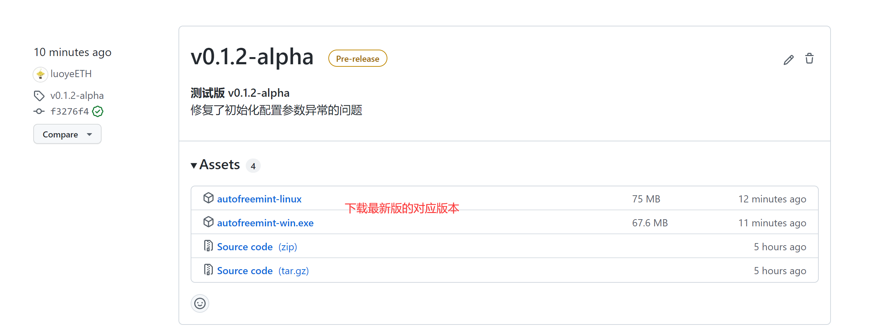

# autoFreeMint_pkg
# 快速开始    
下载地址=====>>> [release](https://github.com/luoyeETH/autoFreeMint_pkg/releases)  
  

简单演示视频===>>> [查看](https://www.bilibili.com/video/BV1Pe4y1o7Lg/)  

有问题可以提issue===>>> [issue](https://github.com/luoyeETH/autoFreeMint_pkg/issues) 

# 使用说明  
## 文件目录说明

autofreemint-win.exe/autofreemint-linux  跟单程序  
keystore                                 加密后的私钥将保存在这个目录下  
config.json                              配置文件  
privateKey.json                          首次运行时填写私钥和密码   

## 首次运行流程  
1.启动跟单程序 如果缺少配置文件会自动生成  
2.在privateKey.json中填写私钥和密码  
```
{
    "privateKeyList": [
        "私钥1",
        "私钥2"
    ],
    "password": "密码"
}
```  

3.重新启动跟单程序 按提示配置相关设置  
(可选)4.输入密码 启动程序  

>linux简易教程 
```
mkdir autofreemint
cd autofreemint
wget https://github.com/luoyeETH/autoFreeMint_pkg/releases/download/v0.1.7-alpha/autofreemint-linux
chmod +x autofreemint-linux
./autofreemint-linux 首次运行生成keystore文件夹和privateKey.json
vim privateKey.json (或使用xftp等工具打开编辑)
./autofreemint-linux 按要求完成配置
保持后台运行 nohup ./autofreemint-linux & 
```

## 配置项说明  

### 默认配置说明  
默认配置只需要用户填写alchemyKey和followAddress  
将默认开启pending跟单模式，并以最大50，优先费2的预设gas发送交易，只跟免费交易，不做gas消耗限制，启动全部账户。  

### 配置项详解  
```
{
	"required": {
		"alchemyKey": "",
		"followAddress": [
			""
		]
	},
	"optional": {
		"password": "",
		"runMode": "pending",
		"mintToMode": "self",
		"maxPriority": 2,
		"maxGasPrice": 50,
		"maxValue": 0,
		"autoGas": {
			"enable": false,
			"gasMode": "fast"
		},
		"maxGas_USD": {
			"enable": false,
			"value": 0
		},
		"useAccount": {
			"enable": false,
			"value": 0
		},
		"multiAccountConfig": {
			"enable": false,
			"gasGearsList": [],
			"useAccountGearsList": []
		},
		"messagePushConfig": {
			"enable": false,
			"pushFlag_dc": false,
			"discordKey": "",
			"pushFlag_bark": false,
			"barkKey": ""
		},
		"contractBlacklist": [
			"0x00000000006c3852cbef3e08e8df289169ede581",
			"0x74312363e45dcaba76c59ec49a7aa8a65a67eed3",
			"0x59728544b08ab483533076417fbbb2fd0b17ce3a",
			"0x084b1c3c81545d370f3634392de611caabff8148",
			"0x83c8f28c26bf6aaca652df1dbbe0e1b56f8baba2",
			"0x0a267cf51ef038fc00e71801f5a524aec06e4f07",
			"0xb4fbf271143f4fbf7b91a5ded31805e42b2208d6",
			"0x283Af0B28c62C092C9727F1Ee09c02CA627EB7F5"
		],
		"methodBlacklist": [
			"0x",
			"0xa22cb465",
			"0x42842e0e",
			"0x23b872dd",
			"0x095ea7b3"
		]
	},
	"test": {
		"enable": false,
		"testnet": "goerli"
	}
}
}
```

`required` 必填项  
`alchemyKey` alchemyKey提供的apiKey，[申请地址](https://alchemyapi.io/)，填写到双引号中  
`followAddress` 要跟随的地址，填写的格式为["地址1","地址2"]  
  
 `optional` 可选项  
 `password` keystore的密码，可不填。不填写时需要每次启动时手动输入密码  
 `runMode` [pending/log] 两种跟单模式，pending更快，但有可能跟到非mint的操作，log慢一个区块，只会跟mint操作。默认为pending模式  
 `mintToMode` [self/collect] 针对mintTo方法，跟单会自动替换为自己地址，self模式会替换到发送者地址，需要手动归集或重复授权上架，collect会替换为第一个加载的账户地址，mint时即完成归集，但可能受不同合约影响mint失败。默认为self模式    
 `maxPriority` 预设的优先费，优先费越高的交易在同一区块中更快被确认。默认为2  
 `maxGasPrice` 预设的最大gasPrice。默认为50
 > 预设gas只在autoGas关闭情况下生效  
 
 `maxValue` 最大跟单时的付费金额，单位eth。默认为0  
 `autoGas` 自动gas模式  
 ----`enable` [true/false] autoGas开关，打开时为自动gas模式，关闭时为预设gas模式。默认关闭  
 ----`gasMode` [fast/normal] 自动gas速度选择，fast速度更快，消耗gas更多，normal消耗gas略低，但可能会失败。默认fast  
 


